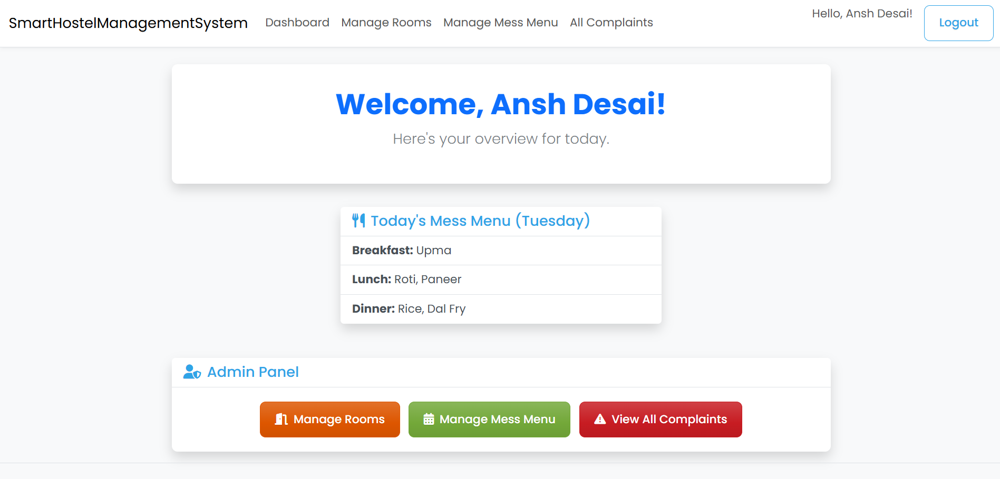
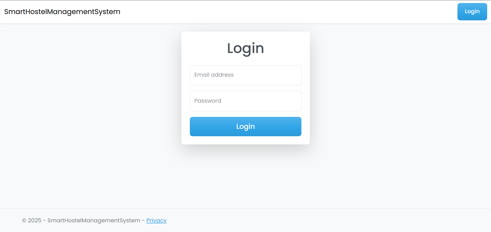
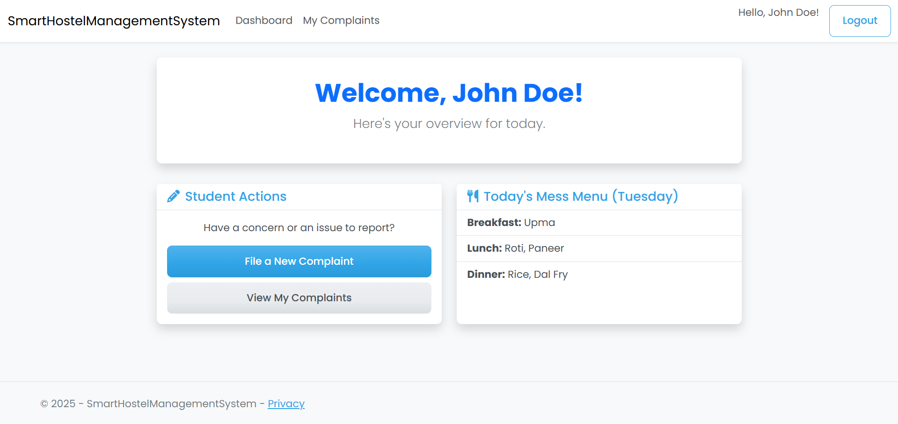

# Smart Hostel Management System

A modern, full-featured web application built using ASP.NET Core 8.0 MVC. It provides a complete solution for managing a student hostel, from room allocation and complaints to mess menu planning. The system features two distinct roles: **Student** and **Admin (Warden)**, each with a custom dashboard and specific permissions.

Here is a showcase of the application's user interface and core features.

### 1. Admin Dashboard
An all-in-one hub for the admin/warden to manage all hostel operations.


### 2. Secure Login Page
A clean, modern, and centered login form.


### 3. Student Dashboard
A dashboard for students to check out the mess menu, file complaints, and view complaint status.

---

## 🏛️ Core Features & Concepts

This application demonstrates several key concepts of modern web development, combining user-facing features with a robust backend architecture.

### 1. Role-Based Authentication (Session State)
The system uses **Session State** to manage user authentication. When a user logs in, their `UserId`, `UserName`, and `IsAdmin` status are saved in a temporary session. This "session cookie" is checked with every request to:
* Secure admin-only pages.
* Show the correct navigation links (`My Complaints` vs. `Manage Rooms`).
* Display the correct dashboard for the logged-in user.

### 2. Performance (In-Memory Caching)
To ensure the dashboard loads instantly, the **"Today's Mess Menu"** is cached using `IMemoryCache`.
* The menu is fetched from the database only once per day.
* It's then stored in the server's high-speed memory.
* All subsequent users see the menu instantly, reducing database load and making the app feel significantly faster.

### 3. Database (SQLite & EF Core)
The project uses **SQLite**, a serverless, file-based database. This makes the project highly portable and easy to run without any database setup.
* **Entity Framework Core (EF Core)** is used as the ORM (Object-Relational Mapper).
* This allows the app to use C# models (like `Student.cs`, `Room.cs`) to interact with the database instead of writing raw SQL.

### 4. Interactive UI (DataTables.js)
All data lists (like "All Complaints") are enhanced with **DataTables.js**. This JavaScript library automatically adds essential features like:
* Live Search / Filtering
* Column Sorting
* Pagination

---

## 🛠️ Tech Stack

* **Framework:** ASP.NET Core 8.0 (MVC with Razor Views)
* **Language:** C#
* **Database:** SQLite (via Entity Framework Core 8)
* **Frontend:** Bootstrap 5, HTML, CSS, JavaScript
* **Core Features:**
    * **Authentication:** Session-based authentication
    * **Database Management:** Entity Framework Core Migrations
    * **UI:** Modern card-based design with interactive tables (DataTables.js) and icons (Font Awesome)
    * **Performance:** In-Memory Caching

---

## ✨ Features

### 🧑‍🎓 Student Features
* **Secure Login:** Students can log in to their personal account.
* **Student Dashboard:** View today's mess menu at a glance and access key actions.
* **Complaint Management:** Students can create new complaints and view the status of their past complaints.
* **View Mess Menu:** Access the full mess menu list.

### 👮 Admin (Warden) Features
* **Secure Login:** Admin has a separate account with elevated privileges.
* **Admin Dashboard:** A central hub to manage all hostel operations.
* **Room Management (CRUD):** Add, update, view, and delete hostel rooms and their capacity.
* **Mess Menu Management (CRUD):** Create, update, and delete the daily/weekly mess menu.
* **Complaint Resolution (CRUD):** View all student complaints, update their status (e.g., "Pending" to "Resolved"), and delete them.

---

## 🚀 Getting Started & How to Run

This project is built to be self-contained and easy to run. It uses SQLite, so no external database server is required.

### Prerequisites
* [.NET 8.0 SDK](https://dotnet.microsoft.com/en-us/download/dotnet/8.0)
* A code editor (like Visual Studio Code)
* A terminal (like PowerShell or Command Prompt)

### Installation & Setup

1.  **Clone the repository:**
    ```bash
    git clone [https://github.com/](https://github.com/)<your-username>/SmartHostelManagementSystem.git
    ```

2.  **Navigate to the project directory:**
    ```bash
    cd SmartHostelManagementSystem
    ```

3.  **Restore dependencies:**
    This command downloads all the necessary packages (like ASP.NET Core, EF Core, etc.).
    ```bash
    dotnet restore
    ```

4.  **Create the Database:**
    The project is configured to use EF Core Migrations to automatically build the SQLite database (`hostel.db`) and populate it with seed data.
    ```bash
    dotnet ef database update
    ```
    *(If you get a `dotnet-ef` error, install the tool with: `dotnet tool install --global dotnet-ef`)*

5.  **Run the project!**
    ```bash
    dotnet run
    ```

6.  **Access the application:**
    Open your web browser and navigate to the URL shown in the terminal (usually `https://localhost:7xxx` or `http://localhost:5xxx`).

---

## 🔑 Default Logins

The database is pre-seeded with two user accounts for testing:

* **Admin / Warden:**
    * **Email:** `admin@hostel.com`
    * **Password:** `admin`

* **Student:**
    * **Email:** `john@student.com`
    * **Password:** `password`

---

## 📄 License

This project is licensed under the MIT License. See the `LICENSE` file for details.
